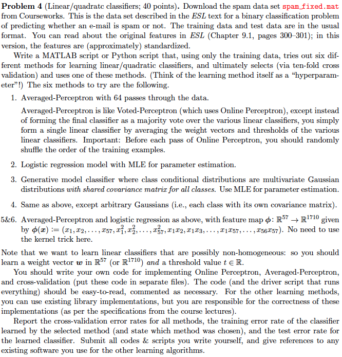

# COMS4721 Homework 2

Daniel M. Sheehan (dms2203)

## Problem 2

| Algorithm | Centering | Standardization |
|---|---|---|
| (a) Multivariate Gaussian distributions with a fixed covariance equal to identity matrix *I* Assume MLE is used for parameter estimation. |  |  |
| (b) The 1-NN classifer using Euclidean distance. |  |  |
| (c) The greedy decision tree learning algorithm with axis-aligned splits. |  |  |
| (d) Empirical Risk Minimization  |  |  |
 
"In centering, you are changing the values, but not the scale." [Centering and Standardizing Predictors](http://www.theanalysisfactor.com/centering-and-standardizing-predictors/) 
 
Explain:

* a. The classifier based on the generative model where class conditional distributions are **multi-variate Gaussian distributions with a mixed covariance** equal to the identity matrix *I*. Assume MLE is used for parameter estimation.

	* **Centering**: Does not have an effect on the classification rate because we're just changing the origin. Its shifted in space but relative positions are the same. We're effecting the model, but not the classifier. But the position of the sep. hyperplane has moved so the model is different. 
	
	* **Standardization**: There is no effect because since they have covariance then the classifier is a straight line. We affect the model, distance but not the classification rate.   
	
* b.  The **1-NN classifer using Euclidean distance**.

	* **Centering**: Centering will not effect 1-NN because the distance between the points will not be altered.
	* **Standardization**: Standarization will effect the 1-NN because the distance between the features will have changed. 
	
* c. The **greedy decision tree learning algorithm** with axis-aligned splits.

	* **Centering**:
	* **Standardization**:

* d. **Empirical Risk Minimization**	

	* **Centering**:
	* **Standardization**:

<!--## Problem 4-->

<!---->

