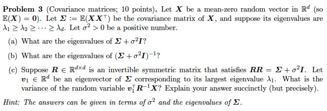

# COMS4721 Spring 2015: Homework 2

Daniel M. Sheehan - dms2203@columbia.edu
Discussants: tudor, jade
## Problem 1 - Skipped (we can pick 2 of the first 3 problems) 

## Problem 2

* a. The classifier based on the generative model where class conditional distributions are **multi-variate Gaussian distributions with a mixed covariance** equal to the identity matrix *I*. Assume MLE is used for parameter estimation.

	* **Centering**: Does not have an effect on the classification rate because we're just changing the origin. Its shifted in space but relative positions are the same. We're effecting the model, but not the classifier. But the position of the sep. hyperplane has moved so the model is different. 
	
	* **Standardization**: There is no effect because since they have covariance then the classifier is a straight line. We affect the model, distance but not the classification rate.   
	
* b.  The **1-NN classifer using Euclidean distance**.

	* **Centering**: Centering will not effect 1-NN because the distance between the points will not be altered.
	* **Standardization**: Standarization will effect the 1-NN because the distance between the features will have changed. 
	
* c. The **greedy decision tree learning algorithm** with axis-aligned splits.

	* **Centering**: Centering will affect the classifier because it cannot return the global optimal decision tree.
	* **Standardization**: If centering affects it in this instance, standardization also does. 

* d. **Empirical Risk Minimization**	

	* **Centering**: Not certain this can be achieved b/c of complexity. 
	* **Standardization**: ibid

## Problem 3

## Problem 3
$ \sum v = \lambda v $

####a) eigenvalues of $ \sum  + \sigma^2 I $

$ \sum = \begin{bmatrix} 
\sigma_1^2 & \sigma_{12} \\
\sigma_{21} & \sigma_2^2 
\end{bmatrix}$

$ \sigma^2 I + \sum = \begin{bmatrix} 
\sigma_1^2 & \sigma_{12} \\
\sigma_{21} & \sigma_2^2 
\end{bmatrix} + \begin{bmatrix} 
\sigma^2 & 0 \\
0 & \sigma^2 
\end{bmatrix}$

$ \sum \leftarrow orginal \ covariance $

$ \sigma^2 \begin{bmatrix} 
1 & 0 \\
0 & 1 
\end{bmatrix} = \begin{bmatrix} 
\sigma^2 & 0 \\
0 & \sigma^2 
\end{bmatrix}$

$ \sum + \sigma^2I =  \begin{bmatrix} 
\sigma_1^2 + \sigma^2 & \sigma_{12} \\
\sigma_{21} & \sigma_2^2 + \sigma^2
\end{bmatrix} $

---
$ ( \sum + \sigma^2I) v' = \lambda'v'$

---

$ \sum v' + \sigma^2 I v' = \lambda'v' $

$ \sum v' = \lambda'v' - \sigma^2Iv' $

---
$ \sum v' = (\lambda' - \sigma^2)v' $

---

$ v' \ eigenvector \ of \sum $

$ x' - \sigma^2 \ eigenvalue \ of \sum $

$ \lambda' - \sigma^2 = \lambda $

---
$ \lambda' = \lambda + \sigma^2 $

---

####b) eigenvalues of $ (\sum  + \sigma^2 I)^{-1} $

$ ( \sum + \sigma^2I )^{-1} v' = \lambda'v'        $

$ v' = \lambda' ( \sum + \sigma^2 I ) v' $ 

$ \dfrac{1}{\lambda'} v' = ( \sum + \sigma^2 I ) v' $

$ = \sum v' + \sigma^2 v' $

$ \sum v' = \dfrac{1}{\lambda'} v'  - \sigma^2 v' $

$ \sum v' = (\dfrac{1}{\lambda'}  - \sigma^2 ) v' , \leftarrow this \ here \ is \ \lambda$

$ \lambda = \dfrac{1}{\lambda'} - \sigma^2 $

$ \lambda + \sigma^2 = \dfrac{1}{\lambda'} $

---
$ \lambda' = \dfrac{1}{\lambda + \sigma^2} $

---

####c) 

$ RR = \sum + \sigma^2 I $

$ R^{-1}R = I, \ \ RR^{-1} = I $

$ \sum v_1 = \lambda_1 v_1 $ 

$ E(X) = 0 $

$ Y = v_1^T R^{-1} X $

$ \mu_Y = E(Y) = E(v_1^T, R^{-1} X) $

$ = v_1^T R^{-1} E(X), \leftarrow which \ is \ 0 $

$ Var(Y) = E[Y^2] $

$ = E [(v_1^T R^{-1} X) ( v_1^T R^{-1} X)^T ] $

$ = E [v_1^TR^{-1} X X^T R^{-T} v_1 ]    $

$ = v_1^TR^{-1} E( X X^T)  R^{-T} v_1     $

$ = v_1^T R^{-1} \sum R^{-T} v_1 $

$ RR = \sum + \sigma^2I, \ \ \ \ \ \  R = R^T \rightarrow R^{-1} = (R^{-1})^T $

$R^{-1}RR = R^{-1} \sum + \sigma^2 R^{-1} I $

^ $ \ above \ is \ IR, \ which \ is \ R $

$ R = R^{-1}\sum + \sigma^2 R^{-1}, \ \ \ x(R^{-1})^T = R^{-1}$

$ RR^{-1} = R^{-1} \sum R^{-T} + \sigma^2 R^{-1} R^{-1} $

$ I = R^{-1} \sum R^{-T} + \sigma^2 R^{-1} R^{-1} $

$R^{-1} \sum R^{-T} = I - \sigma^2 R{-1} R^{-1} $

$Var(Y) = v_1^T(I - \sigma^2 R^{-1} R^{-1} ) v_1 $

$ = v_1^T v_1 - \sigma^2 v_1^T R^{-1} R^{-1}  v_1 $

$ = 1 - \sigma^2 v_1^T R^{-1} R^{-1} v_1 $

$ \sum v_1 = \lambda_1 v_1, \leftarrow \sum = RR - \sigma^2I $ 

$ RR = \sum + \sigma^2 I $

$ RR v_1 = (\lambda_1 + \sigma^2 ) v_1 $
multiply both sides by $R^{-1}$

$ R^{-1}RR v_1 = R^{-1}(\lambda_1 + \sigma^2 ) v_1 $

^ $ is \ I $

$ Rv_1  = (\lambda_1 + \sigma^2) R^{-1} v_1 $

---
$ R^{-1}v_1 = \dfrac{R v_1}{\lambda_1 + \sigma^2} $

---

transpose

$ (R^{-1} v_1)^T = V_1^T R^{-T} = v_1^T R^{-1} = \dfrac{v_1^T R^T}{\lambda_1 + \sigma^2} $

---
$ \rightarrow v_1^T R^{-1} = \dfrac{v_1^T R}{\lambda_1 + \sigma^2} $

---

$ var(Y) = 1 - \sigma^2 v_1^T R^{-1} R^{-1} v_1 $

$ = 1 - \sigma^2 (\dfrac{v_1^T R}{\lambda_1 + \sigma^2})(\dfrac{Rv_1}{\lambda_1 + \sigma^2}) $

$ = 1 - \dfrac{\sigma^2}{(\lambda_1 + \sigma^2)^2} v_1^T ( RR ) v_1  $

$ \ \ \ \  note: RR = \sum + \sigma^2 I $

$ = 1 - \dfrac{\sigma^2}{(\lambda_1 + \sigma^2)^2} [v_1^T \sum v_1 + \sigma^2 v_1^T v_1$

$ \ \ \ v_1^Tv_1 \ is \ 1 $

$ = 1 - \dfrac{\sigma^2}{(\lambda_1 + \sigma^2)^2} (\lambda_1 + \sigma^2)    $

---
$ = 1 - \dfrac{\sigma^2}{\lambda_1 + \sigma^2}  $

---

## Problem 4

    from scipy.io import loadmat
    import numpy as np
    from sklearn.linear_model import LogisticRegression
    from sklearn.ensemble import RandomForestClassifier
    
    data = loadmat('spam_fixed.mat')
    
    Ytrain = data['labels'].flatten()
    Xtrain = data['data']
    Ytest  = data['testlabels'].flatten()
    Xtest  = data['testdata']
    
    class Perceptron(object):
    	def fit(self, X, Y):
    		N, D = X.shape
    		V = [np.zeros(D)]
    		C = [0]
    		for t in xrange(64):
    			for i in xrange(N):
    				v = V[-1]
    				y_hat_i = np.sign(v.dot(X[i]))
    				if y_hat_i == Y[i]:
    					C[-1] = C[-1] + 1
    				else:
    					new_v = v + Y[i]*X[i]
    					V.append(new_v)
    					C.append(1)
    				
    		self.v = np.zeros(D)
    		total_votes = 0
    		for c, v in zip(C[1:], V[1:]):
    			self.v += c*v
    			total_votes += c
    		self.v /= total_votes
    
    	def score(self, X, Y):
    		P = np.sign(X.dot(self.v))
    		return np.mean(P == Y)
    
    class BigPerceptron(object):
    	def fit(self, X, Y):
    		X2 = transform(X)
    		self.model = Perceptron()
    		self.model.fit(X2, Y)
    
    	def score(self, X, Y):
    		X2 = transform(X)
    		return self.model.score(X2, Y)
    
    class Gauss1(object):
    	# Ax = b
    	# x = inv_A * b
    	# solve(A, b)
    	def fit(self, X, Y):
    		# w = inv_cov * (mu1 - mu0)
    		# b = 0.5*(mu1 + mu0) * inv_cov * (mu0 - mu1) + log(pi1/pi0)
    		cov = np.cov(X.T)
    		idx1 = np.where(Y == 1)[0]
    		idx0 = np.where(Y == -1)[0]
    		mu0 = X[idx0, :].mean(axis=0)
    		mu1 = X[idx1, :].mean(axis=0)
    		self.w = np.linalg.solve(cov, mu1 - mu0)
    		N = len(Y)
    		pi1 = float(len(idx1)) / N
    		pi0 = float(len(idx0)) / N
    		self.b = -0.5*(mu0 + mu1).dot(self.w) + np.log(pi1/pi0)
    
    	def score(self, X, Y):
    		P = np.sign(X.dot(self.w) + self.b)
    		return np.mean(P == Y)
    
    class Gauss2(object):
    	def fit(self, X, Y):
    		idx1 = np.where(Y == 1)[0]
    		idx0 = np.where(Y == -1)[0]
    
    		x0 = X[idx0, :]
    		x1 = X[idx1, :]
    		mu0 = x0.mean(axis=0)
    		mu1 = x1.mean(axis=0)
    		cov0 = np.cov(x0.T)
    		cov1 = np.cov(x1.T)
    
    		self.A = 0.5*(np.linalg.inv(cov0) - np.linalg.inv(cov1))
    		icov0mu0 = np.linalg.solve(cov0, mu0)
    		icov1mu1 = np.linalg.solve(cov1, mu1)
    		self.w = icov1mu1 - icov0mu0
    		N = len(Y)
    		pi1 = float(len(idx1)) / N
    		pi0 = float(len(idx0)) / N
    		self.b = 0.5*(mu0.dot(icov0mu0) - mu1.dot(icov1mu1)) + np.log(pi1/pi0)	
    
    	def score(self, X, Y):
    		P = np.sign((X.dot(self.A)*X).sum(axis=1) + X.dot(self.w) + self.b)
    		return np.mean(P == Y)
    
    def transform(X):
    	N, D = X.shape
    	X2 = np.zeros((N, 1710))
    	X2[:,:D] = X
    	j = D
    	for i in xrange(D):
    		for k in xrange(D):
    			if i <= k:
    				X2[:,j] = X[:,i]*X[:,k]
    				j += 1
    	# mu = X2.mean(axis=0)
    	# std = X2.std(axis=0)
    	# X2 = (X2 - mu) / std
    	return X2
    
    class BigLogistic(object):
    	def fit(self, X, Y):
    		X2 = transform(X)
    		self.model = LogisticRegression()
    		self.model.fit(X2, Y)
    
    	def score(self, X, Y):
    		X2 = transform(X)
    		return self.model.score(X2, Y)
    
    def cross_validation(model, X, Y):
    	# split the data into 10 parts
    	N = len(Y)
    	batchsize = N / 10 + 1
    	scores = []
    	for i in xrange(10):
    		# test on i-th part, train on other 9 parts
    		# (i + 1)*batchsize
    		start = i*batchsize
    		end = (i*batchsize + batchsize)
    		Xvalid = X[start:end]
    		Yvalid = Y[start:end]
    
    		Xtrain = np.concatenate([  X[:start] , X[end:] ])
    		Ytrain = np.concatenate([  Y[:start] , Y[end:] ])
    
    		model.fit(Xtrain, Ytrain)
    		scores.append(model.score(Xvalid, Yvalid))
    	return np.mean(scores)
    
    
    models = {
    	'2. Logistic': LogisticRegression(),
    	'TEST for. RandomForest': RandomForestClassifier(),
    	'1. Perceptron': Perceptron(),
    	'6. Big Logistic': BigLogistic(),
    	'5. Big Perceptron': BigPerceptron(),
    	'3. Gauss 1': Gauss1(),
    	'4. Gauss 2': Gauss2(),
    }
    
    def main():
    	for name, model in models.iteritems():
    		print "Model:", name, "accuracy:", cross_validation(model, Xtrain, Ytrain)
    
    if __name__ == '__main__':
    	main()

    Model: 5. Big Perceptron accuracy: 0.912894492741
    Model: 2. Logistic accuracy: 0.918437344953
    Model: TEST for. RandomForest accuracy: 0.938654356408
    Model: 3. Gauss 1 accuracy: 0.868188191643
    Model: 4. Gauss 2 accuracy: 0.806716353517
    Model: 1. Perceptron accuracy: 0.918415773238
    Model: 6. Big Logistic accuracy: 0.923985590094

    
